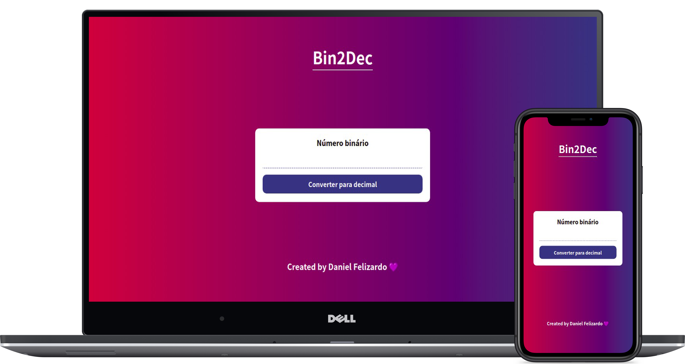

<h1 align="center">👾 Bin2Dec</h1>

<h3 align="center">
  Bin2Dec - app ideas challenge
</h3>

  <a href="#hammer-setup-instructions">🔨 Setup Instructions</a>&nbsp;&nbsp;&nbsp;|&nbsp;&nbsp;&nbsp;
  <a href="#electric_plug-technologies">🔌 Technologies</a>&nbsp;&nbsp;&nbsp;|&nbsp;&nbsp;&nbsp;
  <a href="#bulb-future-features">💡 Future features</a>&nbsp;&nbsp;&nbsp;

  

  
  
  

---

## :hammer: Setup instructions

You can open the `index.html` file in your browser, or enable a tool, if you are using `VSCode`: [live-server](https://marketplace.visualstudio.com/items?itemName=ritwickdey.LiveServer)

When installing, right click on the `index.html` file and select the option: `Open with Live Server`.

It will open a port on your system, usually on port `5500`. Then, you can access the url: `http://localhost:5500/`.

---

## :electric_plug: Technologies

Technologies that I used to develop this application

- [HTML5](https://developer.mozilla.org/en-US/docs/Web/Guide/HTML/HTML5)
- [CSS3](https://developer.mozilla.org/en-US/docs/Archive/CSS3)
- [Javascript](https://www.javascript.com/)

---

## :bulb: Future features

- Add other base conversions;
- Create a button to convert the opposite of the selected one;

---

Made with :purple_heart: by Daniel Felizardo 👋 [See my linkedin](https://www.linkedin.com/in/daniel-felizardo/)